# TriCoin

<p align="center">
  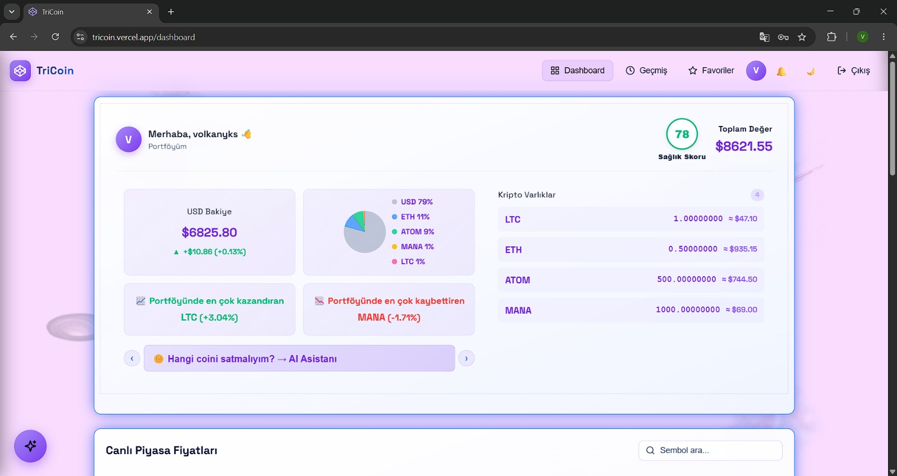
</p>

<p align="center">
  <a href="https://tricoin.vercel.app"><b>🔗 Live Demo — tricoin.vercel.app</b></a>
</p>

<p align="center">
  
  
  
  
  
  
  
  
</p>

TriCoin is a full-stack crypto trading simulator. It streams near-real-time market prices for 20 coins, lets users trade against a simulated USD balance with a locked-quote execution model, and adds an AI layer (Google Gemini) that answers portfolio questions and scores portfolio health — all grounded strictly in the user's own account data.

**Backend:** Spring Boot 4.1 (Java 17) · **Frontend:** React 19 + Vite 8 · **Database:** PostgreSQL 16 · **Cache / Sessions:** Redis 7 · **AI:** Google Gemini

**Team:** Hilal Ayşe AKGÜL · Sude Naz AKTAŞ · Volkan YÜKSEL — i2i Academy Internship Program

---

## Screenshots

<table>
  <tr>
    <td width="50%"><b>Login</b><br>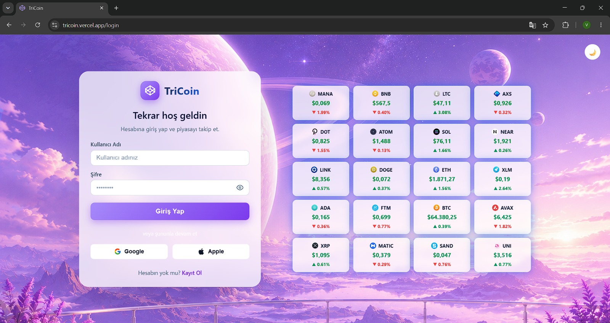</td>
    <td width="50%"><b>Register</b><br>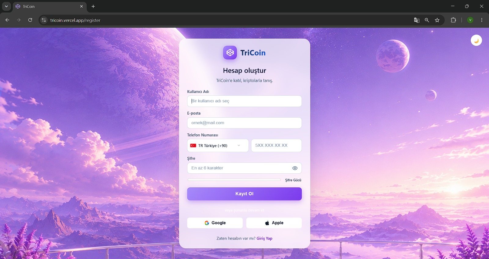</td>
  </tr>
  <tr>
    <td width="50%"><b>AI-generated portfolio health score</b><br>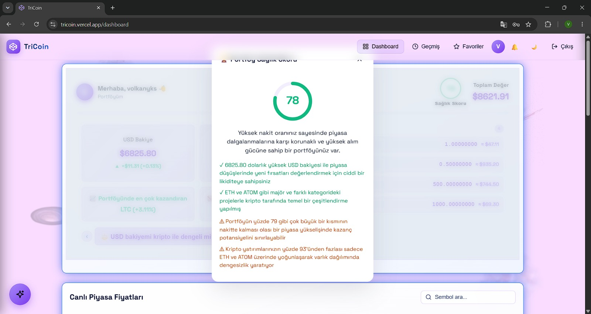</td>
    <td width="50%"><b>Trade modal — 30-second locked quote + price alert</b><br>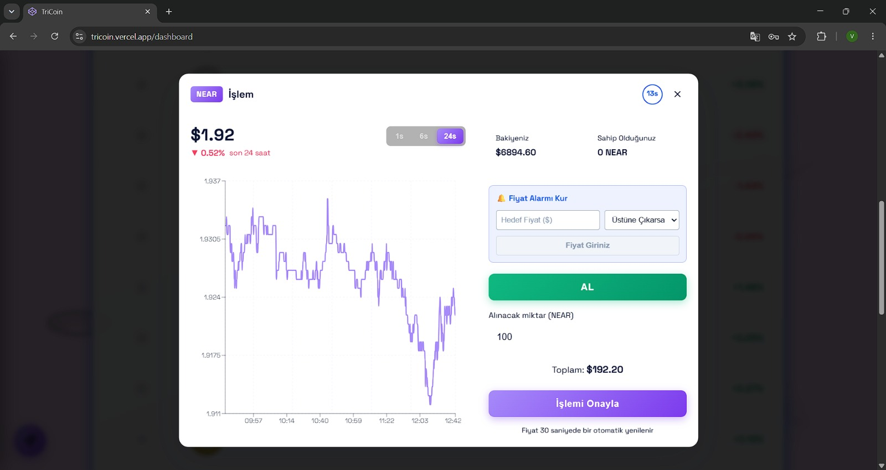</td>
  </tr>
  <tr>
    <td width="50%"><b>AI Assistant — portfolio Q&A</b><br>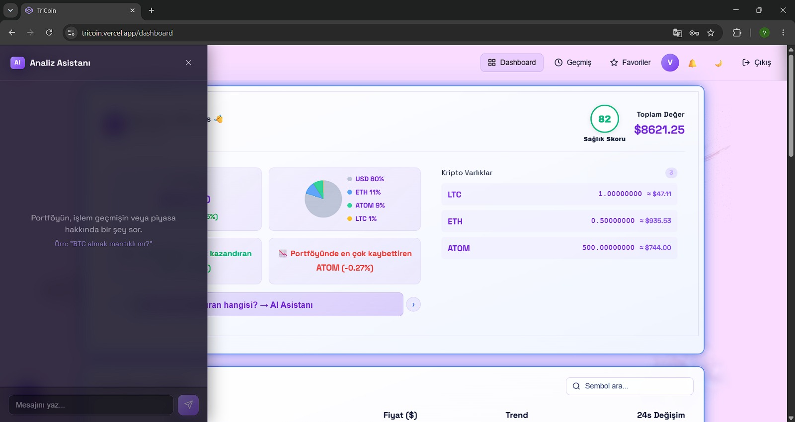</td>
    <td width="50%"><b>Transaction history</b><br>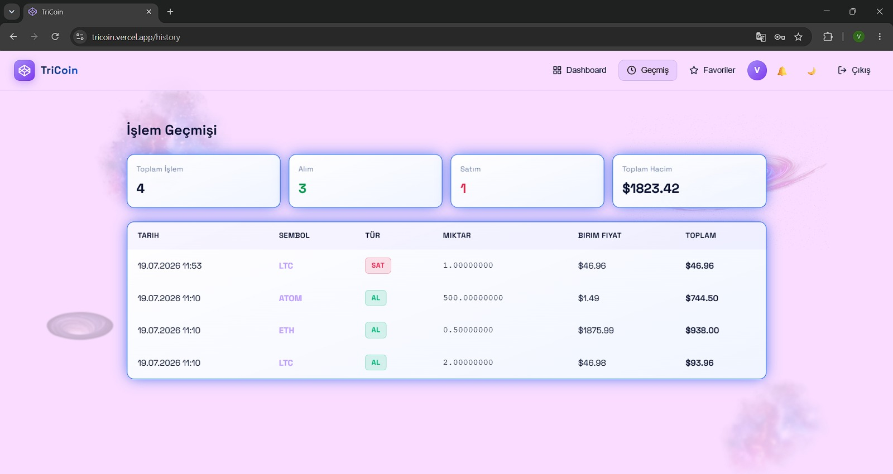</td>
  </tr>
  <tr>
    <td width="50%"><b>Favorites</b><br>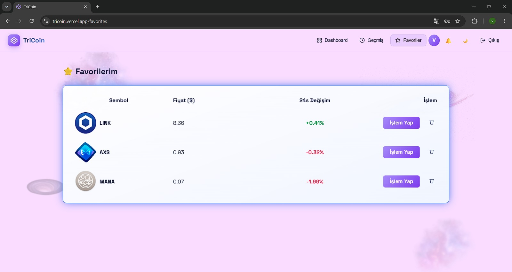</td>
    <td width="50%"><b>Account settings — password & profile picture</b><br>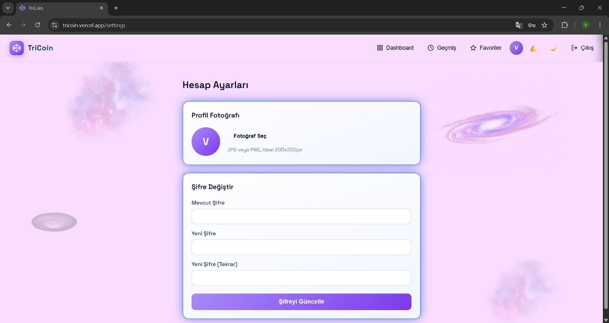</td>
  </tr>
</table>

---

## Table of Contents

- [Screenshots](#screenshots)
- [Architecture](#architecture)
- [Features](#features)
- [Tech Stack](#tech-stack)
- [Project Structure](#project-structure)
- [Data Model](#data-model)
- [Getting Started](#getting-started)
- [Configuration Reference](#configuration-reference)
- [API Reference](#api-reference)
- [Architectural & Functional Details](#architectural--functional-details)
- [Known Rough Edges](#known-rough-edges)

---

## Architecture

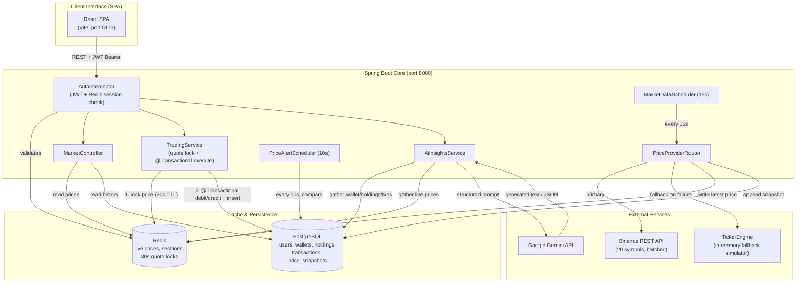

**Flow breakdown (from the code, not marketing copy):**

1. **Price ingestion.** `MarketDataScheduler` runs every 15 seconds (`@Scheduled(fixedRate = 15000)`) and asks `PriceProviderRouter` for the latest prices. The router always tries `BinancePriceProvider` first — one batched `GET /api/v3/ticker/24hr` call covering all 20 symbols. If that call throws for any reason, it silently falls back to `TickerEngine`, an in-memory simulator that random-walks each price by ±1% per tick and assigns a random ±5% 24h-change figure, so the frontend never sees a gap.
2. **Dual-write on every tick.** Each price update is written to both stores for different reasons: Redis (`price:{SYMBOL}`, no TTL — always the latest value, read by every "current price" query) for low-latency reads, and PostgreSQL (`price_snapshots`, append-only) for anything that needs history, like the price chart.
3. **Auth gate.** Every `/api/**` request except `/api/auth/**`, `/api/health`, `/api/market/**`, and static assets passes through `AuthInterceptor`, which requires both a valid JWT *and* a live matching session key in Redis — logout actually revokes access, not just token expiry (details and code in [Architectural & Functional Details](#architectural--functional-details)).
4. **Quote-locked trading.** `TradingService.getQuote()` locks the current Redis price under `reserved_price:{username}:{symbol}` for 30 seconds; `executeTrade()` can only spend that locked price, never a live one, and the whole debit/credit + holdings update + ledger insert runs inside a single `@Transactional` method (full walkthrough with code in [Architectural & Functional Details](#architectural--functional-details)).
5. **Alert evaluation.** `PriceAlertScheduler` runs every 10 seconds, pulling all untriggered alerts and comparing each target price/direction against the latest row in `price_snapshots`.
6. **AI context assembly.** `AiInsightsService` reads the user's wallet, holdings, and last 10 transactions from PostgreSQL, plus every live price from Redis, and hands it all to `PromptBuilder`, which assembles one structured prompt with explicit behavioral rules (answer only from the supplied data, mirror the question's language, never issue a hard buy/sell instruction). `GeminiClient` posts that prompt to Gemini's `generateContent` endpoint over a plain `java.net.http.HttpClient` call and returns the generated text — or, on any failure, a `503` that the frontend renders as a graceful message instead of a crash.

---

## Features

### 🔐 Authentication & Accounts

<p align="center">
  
  
  
</p>

- Register / login with BCrypt-hashed passwords (Spring Security's `PasswordEncoder`, never logged or stored in plain text)
- Stateless JWT (HS256, `jjwt`) issued on login, plus a mirrored session entry in Redis with a 1-hour TTL — both must be valid for a request to pass
- Every new account is seeded with a **random starting balance between $1,000 and $10,000**
- Change password (re-verifies the current password first)
- Upload a profile picture (validated as an image MIME type, stored under `uploads/avatars/`, served back at `/uploads/avatars/{file}`)

### 📈 Market Data
- 20 coins tracked: BTC, ETH, SOL, XRP, ADA, DOT, AVAX, LINK, UNI, DOGE, LTC, BNB, MATIC, XLM, ATOM, NEAR, FTM, SAND, MANA, AXS
- Prices refreshed from Binance every 15 seconds, batched into a single API call
- Automatic, transparent fallback to a local `TickerEngine` simulator if Binance is unreachable — the frontend never sees a gap
- Historical price snapshots queryable per symbol (`GET /api/market/history/{symbol}?hours=N`) for chart rendering

### 💱 Trading

<p align="center"></p>

- **30-second quote lock**: requesting a quote freezes that price in Redis for exactly 30 seconds; the trade can only execute against that locked price, not a live one
- Buys and sells are `@Transactional` — wallet debit/credit, holdings update, and the transaction log insert all commit or roll back together
- Domain-level guardrails: rejects buys that exceed the USD balance, rejects sells that exceed the held amount, rejects sells of a symbol never held
- Full transaction history per user, newest first

### 🔔 Price Alerts
- Users can register a target price + direction (`ABOVE` / `BELOW`) for a symbol
- `PriceAlertScheduler` checks all untriggered alerts every 10 seconds against the latest snapshot in `price_snapshots`
- Triggered alerts surface through `GET /api/alerts/triggered` and can be dismissed (which deletes them)

### 🤖 AI Insights (Google Gemini)

<p align="center"></p>

- Free-form chat: `POST /api/ai/query` builds a rich, structured prompt from the user's live balance, holdings (with current market value), last 10 transactions, and all current prices — then forwards it to Gemini
- Portfolio health score: `GET /api/ai/health-score` asks Gemini to return strict JSON (`score`, `summary`, `strengths`, `risks`); the backend strips accidental Markdown code-fences and parses it, falling back to a neutral score of 50 if parsing fails
- Prompt rules baked in: answer only from supplied data (no hallucination), mirror the question's language, never issue a hard buy/sell instruction, always caveat that it isn't financial advice
- If Gemini errors or times out, the API returns `503 LLM_UNAVAILABLE` with a message instead of crashing

### ⭐ Favorites
- Star/unstar a symbol per user, list favorites, idempotent add (returns `already_favorited` instead of erroring on a duplicate)

### 🎨 Frontend
- Pages: Login, Register, Dashboard, History, Favorites, Settings — plus an alternate `NovaDashboard` layout
- Light/dark theme via a `useTheme` hook, toggled from the header
- Trade modal that pulls a live quote, counts down the 30-second lock, and submits the trade
- Portfolio widget with allocation breakdown, notification panel for triggered alerts, and an AI insights chat panel with a typing indicator
- Route protection is a simple client-side gate: any dashboard route redirects to `/login` if `localStorage.session_token` is absent

---

## Tech Stack

| Layer | Technology |
|---|---|
| Backend framework | Spring Boot 4.1, Spring Web MVC, Spring Data JPA |
| Auth | Spring Security (`PasswordEncoder` only), `jjwt` 0.12.6 (JWT), custom `AuthInterceptor` |
| Database | PostgreSQL 16, Hibernate (`ddl-auto: update`) |
| Cache / Sessions | Redis 7 via `spring-boot-starter-data-redis`, raw `RedisTemplate<String,String>` |
| AI | Google Gemini (`generateContent` REST endpoint) |
| HTTP clients | Apache HttpClient 5 (Binance calls via `RestTemplate`), JDK `java.net.http.HttpClient` (Gemini calls) |
| API docs | springdoc-openapi 2.8.5 (Swagger UI), JWT bearer scheme pre-wired |
| Frontend | React 19, Vite 8 |
| Routing | React Router 7 |
| Charts | Recharts |
| HTTP client (frontend) | Axios, with a request interceptor that attaches the stored JWT |
| Linting | oxlint |
| Containerization | Docker Compose (PostgreSQL + Redis only — the app itself runs outside Docker in dev) |

---

## Project Structure

```
i2i-Academy-TriCoin-17/
├── core/                                    # Spring Boot backend
│   ├── src/main/java/com/tricoin/core/
│   │   ├── auth/
│   │   │   ├── AuthController.java          # POST /register, /login
│   │   │   ├── UserController.java          # POST /change-password, /avatar
│   │   │   ├── JwtService.java              # sign/verify JWT
│   │   │   ├── SessionService.java          # Redis session tracking (1h TTL)
│   │   │   ├── AuthInterceptor.java         # guards /api/** except public routes
│   │   │   ├── SecurityConfig.java          # BCrypt bean, permits all (interceptor does the gating)
│   │   │   ├── User.java / Wallet.java      # JPA entities
│   │   │   ├── UserRepository.java / WalletRepository.java
│   │   │   └── dto/                         # Register/Login/ChangePassword/Auth response records
│   │   ├── market/
│   │   │   ├── BinancePriceProvider.java    # primary price source (20 symbols, 1 call)
│   │   │   ├── TickerEngine.java            # fallback random-walk simulator
│   │   │   ├── PriceProviderRouter.java     # tries Binance, falls back on any exception
│   │   │   ├── MarketDataScheduler.java     # @Scheduled(fixedRate = 15000)
│   │   │   ├── MarketController.java        # GET /prices, /history/{symbol}
│   │   │   ├── PriceSnapshot.java / MarketTicker.java
│   │   │   └── PriceSnapshotRepository.java
│   │   ├── trading/
│   │   │   ├── TradingController.java       # GET /quote/{symbol}, POST /execute, GET /history
│   │   │   ├── TradingService.java          # quote lock, @Transactional buy/sell
│   │   │   ├── PortfolioController.java     # GET /api/portfolio (balance + holdings)
│   │   │   ├── CryptoHolding.java / Transaction.java
│   │   │   └── dto/
│   │   ├── ai/
│   │   │   ├── AiController.java            # POST /query, GET /health-score
│   │   │   ├── AiInsightsService.java       # gathers context, calls PromptBuilder + GeminiClient
│   │   │   ├── PromptBuilder.java           # builds the structured Gemini prompt
│   │   │   ├── GeminiClient.java            # raw HTTP call to Gemini's generateContent
│   │   │   └── dto/
│   │   ├── alert/
│   │   │   ├── PriceAlertController.java    # POST /alerts, GET /triggered, DELETE /{id}
│   │   │   ├── PriceAlertScheduler.java     # @Scheduled(fixedRate = 10000)
│   │   │   ├── PriceAlert.java
│   │   │   └── PriceAlertRepository.java
│   │   ├── favorite/
│   │   │   ├── FavoritesController.java     # GET/POST/DELETE /api/favorites
│   │   │   └── Favorite.java / FavoriteRepository.java
│   │   ├── health/HealthController.java     # GET /api/health
│   │   ├── config/
│   │   │   ├── CorsConfig.java              # allows http://localhost:5173 only
│   │   │   ├── WebConfig.java               # registers AuthInterceptor + static /uploads
│   │   │   └── OpenApiConfig.java           # Swagger bearer-auth scheme
│   │   ├── common/
│   │   │   ├── RedisConfig.java             # String-serialized RedisTemplate
│   │   │   └── RestTemplateConfig.java      # pooled HttpClient5-backed RestTemplate
│   │   └── CoreApplication.java
│   ├── src/main/resources/application.yml.example
│   ├── src/test/java/...
│   ├── pom.xml
│   └── .env.example
│
├── web-app/                                 # React (Vite) frontend
│   ├── src/
│   │   ├── pages/
│   │   │   ├── Login.jsx / Register.jsx
│   │   │   ├── Dashboard.jsx / NovaDashboard.jsx   # two dashboard variants
│   │   │   └── History.jsx / Favorites.jsx / Settings.jsx
│   │   ├── components/
│   │   │   ├── DashboardLayout.jsx / Header.jsx / ProfileMenu.jsx
│   │   │   ├── TradeModal.jsx               # quote fetch, 30s countdown, execute
│   │   │   ├── PortfolioWidget.jsx / PortfolioHealthScore.jsx
│   │   │   ├── AiInsights.jsx                # chat UI, typing indicator
│   │   │   ├── NotificationPanel.jsx         # triggered price alerts
│   │   │   └── ThemeToggle.jsx
│   │   ├── hooks/useTheme.js
│   │   ├── services/api.js                  # Axios instance + all endpoint wrappers
│   │   ├── assets/                          # background images/illustrations
│   │   ├── App.jsx                          # routes + client-side auth guard
│   │   └── main.jsx
│   ├── public/
│   ├── vite.config.js
│   └── package.json
│
├── docker/
│   ├── docker-compose.yml                   # postgres:16-alpine (host port 5433) + redis:7-alpine
│   ├── init.sql                             # schema for users/wallets/holdings/transactions/snapshots/favorites
│   └── .env.example
│
├── docs/
└── README.md
```

---

## Data Model

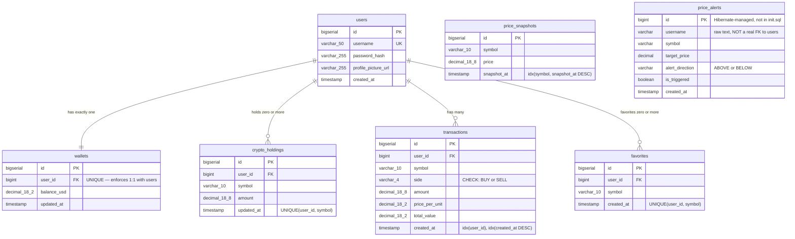

*(`price_snapshots` and `price_alerts` are drawn with no relationship line to `users` on purpose: `price_snapshots` is a global, symbol-keyed table with no user reference at all, and `price_alerts` only stores a raw `username` string rather than a real `user_id` foreign key — see the note below.)*

Notes worth calling out because they aren't obvious from a casual read of the schema:

- `init.sql` (run once by the Postgres container on first boot) defines `users`, `wallets`, `crypto_holdings`, `transactions`, `price_snapshots`, and `favorites`.
- `price_alerts` is **not** in `init.sql` — it's created at runtime by Hibernate because `spring.jpa.hibernate.ddl-auto` is set to `update`. If you rebuild the Postgres container from scratch, the table reappears automatically the next time the backend starts. Unlike every other table here, it isn't wired to `users` with a real foreign key — it just stores the raw `username` string.
- `PriceAlertController.getTriggeredAlerts()` currently hardcodes `"test"` as the username filter rather than reading the authenticated user — worth knowing if alerts don't show up for accounts other than one named `test`.
- `crypto_holdings` stores a running balance per `(user, symbol)`, not a ledger — the ledger is `transactions`.
- Every FK in `init.sql` is declared `ON DELETE CASCADE` — deleting a `users` row cleans up its wallet, holdings, transactions, and favorites automatically; there's no soft-delete or orphaned-row cleanup job needed.

---

## Getting Started

### Prerequisites

- [Docker Desktop](https://www.docker.com/products/docker-desktop/)
- [Java 17+](https://adoptium.net/) (the bundled `mvnw` wrapper handles Maven itself)
- [Node.js 18+](https://nodejs.org/) and npm
- A free [Google Gemini API key](https://aistudio.google.com/apikey)

### 1. Clone

```bash
git clone https://github.com/volkanyks57/i2i-Academy-TriCoin-17.git
cd i2i-Academy-TriCoin-17
```

### 2. Environment variables

```bash
cp docker/.env.example docker/.env
cp core/.env.example core/.env
```

Edit `core/.env` and set `GEMINI_API_KEY`. Everything else in both files is already filled in with working local-dev defaults.

### 3. Start PostgreSQL and Redis

```bash
cd docker
docker-compose up -d
docker ps   # expect tricoin-postgres and tricoin-redis both "healthy"
```

Postgres is exposed on host port **5433** (not the default 5432), and its schema is created automatically from `init.sql` on first boot only — if you change `init.sql` later, you'll need to drop the `postgres_data` volume to see the change take effect.

### 4. Start the backend

Export the variables from `core/.env` (via your shell or IDE run config), then:

```bash
cd ../core
./mvnw spring-boot:run
```

Look for `Started CoreApplication` in the console — the API is now live at `http://localhost:8080`.

### 5. Start the frontend

```bash
cd web-app
npm install
npm run dev
```

Open the URL Vite prints — typically `http://localhost:5173`. This is the *only* origin the backend's CORS config allows by default (`CorsConfig`), so running the frontend on a different port will fail CORS.

### 6. Sanity checks

- `GET http://localhost:8080/api/health` → `{"status":"UP","service":"tricoin-core"}`
- Swagger UI: `http://localhost:8080/swagger-ui/index.html`

---

## Configuration Reference

### Two files, two jobs: `application.yml.example` and `.env.example`

`application.yml.example` (Spring Boot's config template) and the two `.env.example` files solve different problems, and neither is redundant:

- **`core/src/main/resources/application.yml.example`** defines the *shape* of the config — which settings exist and where they're read from — with no real secrets in it:
  ```yaml
  datasource:
    url: jdbc:postgresql://${DB_HOST:localhost}:${DB_PORT:5433}/${DB_NAME:tricoin}
    username: ${DB_USERNAME:tricoin_user}
    password: ${DB_PASSWORD:tricoin_pass}
  ```
  `${DB_USERNAME:tricoin_user}` means "use the `DB_USERNAME` env var if set, otherwise `tricoin_user`."
- **`core/.env.example`** and **`docker/.env.example`** supply the actual *values* for those placeholders — e.g. `DB_USERNAME=tricoin_user`, `JWT_SECRET=...`, `GEMINI_API_KEY=...`.

They're kept apart because: (1) different consumers read them — Spring Boot loads `application.yml` directly, while nothing auto-loads `.env` (you export it yourself, or `docker-compose` reads `docker/.env` for container vars); (2) different lifecycle — `application.yml.example` is checked-in and identical for everyone, while `.env` is personal/secret and never committed, which keeps the file Spring Boot loads directly free of secrets by construction; (3) `docker-compose.yml` and Spring Boot are two separate tools that each need their own env source.

Both `.env` files must be copied before anything works:

```bash
cp docker/.env.example docker/.env   # read only by docker-compose.yml — Postgres container creds
cp core/.env.example core/.env       # read by the Spring Boot app — DB creds, JWT_SECRET, GEMINI_API_KEY
```

Spring Boot doesn't auto-load `core/.env` — export those variables into the process yourself: paste them into your IDE's run config, run `export $(grep -v '^#' core/.env | xargs)` before `./mvnw spring-boot:run`, or use `direnv`/`dotenv-cli`. Neither `.env` file is committed — the root `.gitignore` excludes `*.env` (with an exception for `*.env.example`) and also excludes a real `core/src/main/resources/application.yml` if one is ever created.

### Getting a Gemini API key

1. Go to **https://aistudio.google.com/apikey**.
2. Sign in with a Google account and click **Create API key** (free tier, no credit card required).
3. Paste it into `core/.env` as `GEMINI_API_KEY=your-key-here`.

Skipping this only affects `/api/ai/query` and `/api/ai/health-score`: `GeminiClient` calls Gemini with an empty `key=`, Gemini rejects it, `GeminiClient.generate()` throws `IllegalStateException`, and `AiController` turns that into a clean `503 LLM_UNAVAILABLE` instead of a stack trace. Everything else (auth, trading, market data, alerts, favorites) works with no Gemini key at all.

### Full variable reference

From `core/src/main/resources/application.yml.example`, resolved via environment variables (`${VAR:default}`):

| Variable | Default | Purpose |
|---|---|---|
| `DB_HOST` | `localhost` | Postgres host |
| `DB_PORT` | `5433` | Postgres port (matches the Compose file's mapped port, not Postgres's usual 5432) |
| `DB_NAME` | `tricoin` | Database name |
| `DB_USERNAME` / `DB_PASSWORD` | `tricoin_user` / `tricoin_pass` | Postgres credentials — must match `docker/.env`'s `POSTGRES_USER` / `POSTGRES_PASSWORD` |
| `REDIS_HOST` / `REDIS_PORT` | `localhost` / `6379` | Redis connection (no auth configured — fine locally, not for a public deployment) |
| `JWT_SECRET` | dev placeholder string | HMAC-SHA key used to sign and verify every JWT. **Must be changed for anything beyond local dev** — anyone who knows this value can forge a valid login token for any username. `jjwt`'s `Keys.hmacShaKeyFor()` requires 256+ bits (32+ ASCII characters) or key generation throws at startup. |
| `GEMINI_API_KEY` | *(empty)* | See above — required only for the `/api/ai/**` endpoints |
| `GEMINI_MODEL` | `gemini-3.1-flash-lite` | Which Gemini model `GeminiClient` calls |
| `PORT` | `8080` | Backend HTTP port |

JWTs expire after 1 hour (`jwt.expiration-ms: 3600000`), matching the Redis session TTL — a token can't outlive its session or vice versa.

**If a key isn't being picked up:** confirm you edited `core/.env` (not `docker/.env`); confirm it's actually exported into the process running `./mvnw spring-boot:run`; restart the backend after changing it (`GeminiClient` reads it once at construction via `@Value`); check the logs for `Gemini API call failed: ...` for the real status/message from Google.

---

## API Reference

Interactive docs (try-it-out included) while the backend is running:

**http://localhost:8080/swagger-ui/index.html**

To exercise protected endpoints there: register → login → copy the returned token → click **Authorize** → paste it.

| Method & Path | Auth required | Description |
|---|---|---|
| `POST /api/auth/register` | No | Create an account; seeds a random $1,000–$10,000 balance |
| `POST /api/auth/login` | No | Returns `{ token, username }` |
| `POST /api/user/change-password` | Yes | Requires current password |
| `POST /api/user/avatar` | Yes | Multipart image upload |
| `GET /api/market/prices` | No | All current prices from Redis |
| `GET /api/market/history/{symbol}?hours=N` | No | Historical snapshots (default 24h) |
| `GET /api/portfolio` | Yes | Current balance + holdings |
| `GET /api/trade/quote/{symbol}` | Yes | Locks a price for 30 seconds |
| `POST /api/trade/execute` | Yes | Body: `{ symbol, side, amount }` |
| `GET /api/trade/history` | Yes | All of the user's past trades |
| `POST /api/ai/query` | Yes | Body: `{ message }` — free-form portfolio Q&A |
| `GET /api/ai/health-score` | Yes | Structured `{ score, summary, strengths, risks }` |
| `POST /api/alerts` | Yes* | Create a price alert |
| `GET /api/alerts/triggered` | Yes* | List triggered alerts *(currently hardcoded to the `"test"` user server-side — see note below)* |
| `DELETE /api/alerts/{id}` | Yes* | Dismiss/delete an alert |
| `GET /api/favorites` | Yes | List favorited symbols |
| `POST /api/favorites/{symbol}` | Yes | Add a favorite (idempotent) |
| `DELETE /api/favorites/{symbol}` | Yes | Remove a favorite |
| `GET /api/health` | No | Liveness check |

\* The `/api/alerts/**` routes are not in `WebConfig`'s exclusion list, so they do pass through `AuthInterceptor` like any other protected route — they still require a valid Bearer token, even though `PriceAlertController` doesn't currently use the authenticated username for reads.

---

## Architectural & Functional Details

### 1. Locked-Quote Trade Execution

Without a lock, the price a user sees when clicking "Buy" could drift from the price used moments later at execution — exactly the quote/fill mismatch real exchanges design around. Requesting a quote reserves that exact price in Redis for a fixed 30-second window; execution can only read the reservation, never the live price:

```java
public TradeQuoteResponse getQuote(String username, String symbolRaw) {
    String symbol = symbolRaw.toUpperCase();
    BigDecimal currentPrice = fetchCurrentPrice(symbol);

    String key = RESERVED_PRICE_KEY_PREFIX + username + ":" + symbol;
    redisTemplate.opsForValue().set(key, currentPrice.toPlainString(),
        java.time.Duration.ofSeconds(QUOTE_TTL_SECONDS));

    return new TradeQuoteResponse(symbol, currentPrice, (int) QUOTE_TTL_SECONDS);
}

// Reads the price the user locked in via getQuote(); fails loudly if
// it expired, forcing the client to request a fresh quote.
private BigDecimal fetchReservedPrice(String username, String symbol) {
    String key = RESERVED_PRICE_KEY_PREFIX + username + ":" + symbol;
    String value = redisTemplate.opsForValue().get(key);
    if (value == null) {
        throw new IllegalStateException(
            "Price quote expired or missing — request a new quote before trading");
    }
    return new BigDecimal(value);
}
```

`executeTrade()` calls `fetchReservedPrice()` — not the live Redis price — so the number the user confirmed against is the number they're charged. The reservation is deleted right after a successful trade, so the same locked price can't be replayed for a second execution.

### 2. Transactional Wallet + Holdings Consistency

Debiting/crediting the wallet, updating holdings, and inserting the transaction record all happen inside a single `@Transactional` method. If anything throws partway through — an unexpected exception, a constraint violation — the whole thing rolls back together, so there's no window where money leaves the wallet without a matching holding or ledger entry:

```java
@Transactional
public TradeResponse executeTrade(String username, TradeRequest request) {
    User user = userRepository.findByUsername(username)
        .orElseThrow(() -> new IllegalStateException("User not found"));

    BigDecimal currentPrice = fetchReservedPrice(username, symbol);
    BigDecimal totalValue = amount.multiply(currentPrice).setScale(2, RoundingMode.HALF_UP);

    if ("BUY".equals(side)) {
        executeBuy(user.getId(), symbol, amount, totalValue, wallet);
    } else if ("SELL".equals(side)) {
        executeSell(user.getId(), symbol, amount, totalValue, wallet);
    }
    // ...insert Transaction, delete the reservation
}
```

`executeBuy` rejects the trade if `balance_usd < totalValue` (`400`, `"Insufficient funds"`); `executeSell` rejects it if the user doesn't hold the symbol or doesn't hold enough of it (`400` with a descriptive message) — both checks run inside the same transaction, before any write happens. If the reservation from step 1 is missing entirely, the request fails fast with `400 QUOTE_FAILED`. A successful trade returns the full receipt: id, symbol, side, amount, price, total, new balance, timestamp.

### 3. Dual Price Provider with Silent Fallback

Binance is the authoritative source; `TickerEngine` exists purely so the app degrades gracefully instead of showing an empty dashboard if Binance is unreachable or rate-limiting. `PriceProviderRouter` sits behind both, so every downstream consumer — the scheduler, the quote endpoint, the AI prompt builder — just reads from Redis and never needs to know which provider produced the number:

```java
try {
    return binanceProvider.fetchPrices();
} catch (Exception e) {
    log.warn("Binance unavailable, falling back to TickerEngine: {}", e.getMessage());
    return tickerEngine.fetchPrices();
}
```

### 4. Redis Holds Nothing That Can't Be Regenerated

Live prices are re-polled every 15 seconds regardless of what's cached; sessions and quote locks are designed to expire. Nothing in Redis is backed up, and nothing needs to be — the durable state (accounts, balances, trade history, price history) lives only in PostgreSQL. This is a deliberate boundary: if Redis were flushed mid-session, the worst case is a logged-out user and a 15-second-stale price, not lost data.

### 5. Auth as a Dedicated Interceptor, Not the Security Filter Chain

`SecurityConfig` mainly exists to supply the `BCryptPasswordEncoder` bean and disable CSRF/session auth (`anyRequest().permitAll()`); actual request gating happens in a custom `AuthInterceptor`, registered per-path in `WebConfig` for every `/api/**` route except the public ones. It checks two independent things before letting a request through:

```java
Claims claims = jwtService.parseAndValidate(token);      // signature + expiry
boolean sessionAlive = sessionService.isSessionValid(token); // Redis session still present
if (claims == null || !sessionAlive) {
    response.sendError(HttpServletResponse.SC_UNAUTHORIZED);
    return false;
}
```

A structurally valid, non-expired JWT is still rejected if its Redis session was invalidated — so logging out (or any server-side session cleanup) actually revokes access immediately, rather than relying on the token's own expiry.

### 6. REST Polling Instead of a WebSocket for Prices

A single batched REST call every 15 seconds covers the update cadence the UI actually needs, without taking on WebSocket connection-lifecycle management (reconnects, heartbeats, backpressure) for a feature that doesn't need sub-second updates. This is a smaller-scope tradeoff than a push-based architecture, made deliberately to keep the price-ingestion path simple and easy to reason about.

---

## Known Rough Edges

Worth being aware of if you're extending this project:

- `GET /api/alerts/triggered` reads alerts for a hardcoded `"test"` username rather than the authenticated caller — alerts created by other users won't show up there yet.
- `price_alerts` is schema-managed by Hibernate (`ddl-auto: update`), not by `init.sql` — keep that in mind if you're used to the schema being fully declarative.
- CORS is hardcoded to `http://localhost:5173` — deploying the frontend elsewhere requires updating `CorsConfig`.
- The root-level `package.json` / `package-lock.json` at the repository root are effectively unused placeholders; the real frontend project lives in `web-app/`.

Built for educational purposes as part of the **i2i Academy Internship Program**.

**Team:** Hilal Ayşe AKGÜL · Sude Naz AKTAŞ · Volkan YÜKSEL
